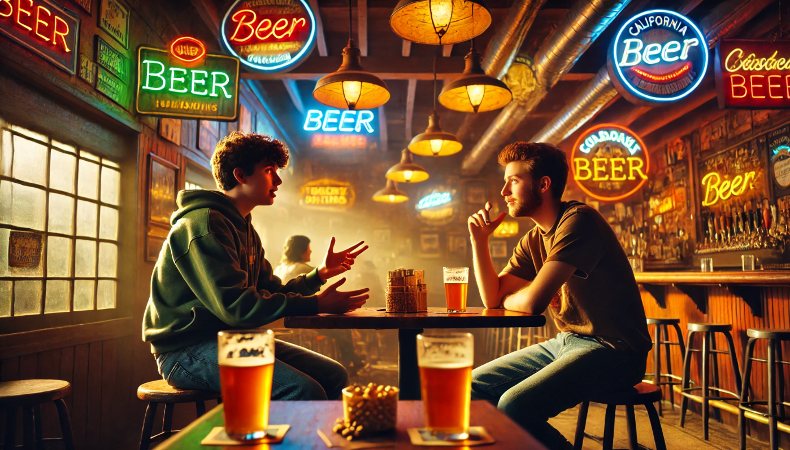
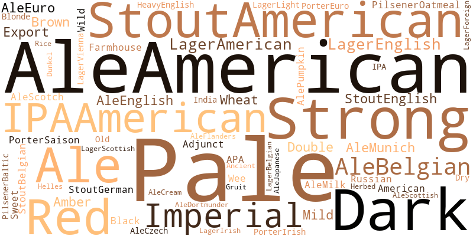

# Pints & Politics: Sipping Through Red, Blue, and Brew US 🍺

*Friday night. Cozy bar in California, USA. At a table, Larry and Jim sit enjoying a beer together.*

**Larry:** (*takes a long sip of his lager*) You know Jim, there’s something poetic about beer. It’s not just a drink – it’s like a mirror for the country. You can tell a lot about people by what’s in their glass.

**Jim:** Yeah I would agree with that… for once. I see elegant people enjoying a nice fancy cocktail. Old folks a glass of whisky… And us, students, a simple, cheap beer.

**Larry:** Nah, that’s not the point I’m making. It’s bigger than just age or class. Think about it, beer is like an unspoken language, man. It reveals where you stand in America, my friend!

**Jim:** (*raises an eyebrow*) Oh, here we go again Larry. Let me guess – you’re about to tell me how beer preferences somehow connect to our political leaning, right?  

**Larry:** Exactly! Think about it… The beers we drink say more about us than we realize.

**Jim:** (*leans back in his chair*) Alright… but where’s your proof? You always come in here with these wild ideas after a few beers.

**Larry:** I’m not giving you a random fun fact. I did some research since the last time we met. And I can guarantee you I found interesting results!

**Jim:** Well, if it’s serious work, now you have my attention.

**Larry:** Oh it’s real work. I analyzed the different beer styles, sentiments, and review ratings across the U.S. I investigated how beer preferences vary by state and if they align with political leanings. Also for swing states, if they gravitate toward specific beer styles during election years. I did all these analyses to see how beer preference trends changed throughout the years of 2004–2016.

**Jim:** (intrigued) Wait, seriously? How did you do all of that? ChatGPT?

*Larry and Jim share a good laugh and take a sip of beer.*

**Larry:** So first, I dug into the BeerAdvocate dataset – over two million reviews from American beer drinkers.

**Jim:** Two million reviews? That’s a lot of data, man. Okay, but how does that connect to politics?

**Larry:** That's where the real fun begins. While BeerAdvocate provides all the beer reviews, I had to gather the political information separately. For that, I used different sources. Firstly, I pulled data on the winning parties in each U.S state, in the election years from 2004 to 2016, from the [U.S. President 1976–2020](https://dataverse.harvard.edu/dataset.xhtml?persistentId=doi:10.7910/DVN/42MVDX) dataset. Also, I gathered data on age-specific voting preferences from exit polls. But here’s a catch – it wasn’t available for all states. You know, exit polls are of interest in states that change their political climate over the years, the so-called swing states. Also, conducting these surveys is quite costly, so for states that are consistently Democrat or Republican, they are usually omitted.

**Jim:** All that looks very nice, but wait – just to make sure I’m following, what exactly are you trying to answer with all that research?

**Larry:** Well, at first I wanted to figure out how beer preferences can be categorized and visualized across different dimensions (such as style, emotions, sentiments, and key attributes) to provide a comprehensive understanding of beer types based on the U.S. reviewers.

**Jim:** Alright, that makes sense. And then? I guess it's linked to politics…

**Larry:** Then, I’m diving deeper. I wanted to see how these beer preferences vary across different U.S. states, and can these preferences be linked to political ideologies. Are there specific beer preferences that correlate with Republican or Democratic voting patterns?

**Jim:** Hmmmmm interesting.

**Larry:** And finally, how do beer preferences change over time during election years, particularly in swing states?

**Jim:** You really look passionate about all that!

**Larry:** I mean yeah, I really love beer. This one is very good by the way.

**Jim:** You know I’m not a beer connoisseur, but I really enjoy that one. Actually, for me, all the beers are kinda the same.

**Larry:** (*laughing*) Well my friend, I think you really didn’t have enough beers in your life to say something like that! Cheers!

*Larry and Jim clink their pints*

**Jim:** Cheers to you!

**Larry:** You know, there are actually 8 main beer styles that people commonly talk about. They are: IPA (India Pale Ale), Pale Ale, Red/Amber Ale, Other Ales (covering remaining Ale subcategories), Lager, Stout, Porter, and Pilsner.

**Jim:** So these are the beer styles you focused on in your research?

**Larry:** Yes! Actually, among the reviewed beers in the dataset, there are 104 unique beer styles. I did matching by keywords into the 8 predefined categories. I was left with 56 unique styles. And to give you a clearer idea of their distribution, here’s a cloud of words.
  

  
  
Figure 1: A word cloud showing beer styles encompassed by our general categories.

  

**Jim:** Looks very nice. So you’ve categorized all these beer styles, but how do you know which ones are actually the most popular?

**Larry:** I see you’re starting to get interested now! I analyzed the number of reviews left by U.S. users for each beer style over the years. Check this out!

*Larry shows the interactive chart on his phone*



**Larry:** What you’re looking at here is the count of reviews by beer style, year by year. You can see a clear increase in the overall number of reviews, especially in the late 2000s and early 2010s. Makes sense right? That’s when internet communities and rating websites started to grow in popularity.

**Jim:** That’s awesome! Yeah, I agree, and I see the top 3 beer styles are the same throughout the years: IPA, Other Ale, and Stout.

**Larry:** Absolutely! And also we can notice that after 2008, Stouts consistently ranked third, showing how stable their popularity is among beer enthusiasts.

**Jim:** What about IPAs? I keep hearing about them everywhere.

**Larry:** You’re right! There was a big rise in IPA reviews starting in the mid-2010s. That’s actually when IPAs became the best-selling style in the [craft beer segment](https://www.beervanablog.com/beervana/2019/12/16/the-2010s-in-review). It’s cool to see how the trends in reviews align with real-world sales data.

**Jim:** So basically, this chart doesn’t just show reviews, does it? It’s like a snapshot of how beer culture evolved.

**Larry:** You’ve got it! It’s fascinating to see how much you can learn from data.

**Jim:** Alright, so you know which beer style is the most reviewed, but does that mean they are also the most highly rated maybe?

**Larry:** Not exactly! That’s what I looked into next – figuring out which beer styles received the highest average ratings across the U.S. For this, I used the mean rating across five categories: aroma, palate, taste, appearance, and overall. Look at this, I’ve got a map that shows how beer style preference evolved over time.



*Jim takes Larry’s phone to play with the chart*

**Jim:** I see Stouts, Porters, and IPAs come out on top.

**Larry:** Exactly! Stouts particularly dominated after 2010, becoming the favorite in most states. In fact, by 2016, Stouts were the highest-rated style in 46 out of 50 states.

**Jim:** But you just told me that IPAs were super popular in reviews, and it has no real impact on ratings.

**Larry:** You’re right. Looks like people loved trying them out, but they didn’t dethrone Stouts when it came to taste.

**Jim:** What about other styles?

**Larry:** Lagers are an interesting case. They were never the favorite beer in any state. And to dive deeper, I analyzed how often each beer style was selected as the favorite in different states, from 2004 to 2016. Look at this, you can explore each state individually



*Jim takes some time to explore the chart by selecting some states*

**Jim:** That’s cool! What did you find?

**Larry:** Well, some states show remarkable loyalty to their beer preferences. For example, Kentucky, Massachusetts, Connecticut, Ohio, and Oregon consistently picked Stouts as their favourite every single year from 2004 to 2016.

**Jim:** Looks like they know what they like… But what about the other states?

**Larry:** That’s where it gets interesting. States such as Montana, North and South Dakota, Alaska, Utah, Vermont, and Wyoming have frequently switched between different beer styles over the years.

**Jim:** I think I can see where you're going with this. So some states are more consistent while others are more… swinging if I can say.  I guess you want to say that this might reflect their unique cultures, and maybe even connect with their political leanings.

**Larry:** Let’s not take the short path and jump to any conclusion directly from here. We have plenty of time.

*Larry and Jim order another round of beers, diving deeper into their discussion.*

**Larry:** Cheers!

**Jim:** Cheers!

**Larry:** Can I ask you a question?

**Jim:** Sure, go ahead!

**Larry:** How do you feel?

**Jim:** What do you mean?

**Larry:** How do you feel enjoying this beer? What sentiment does that bring to you? If you have to describe it?

**Jim:** Huuuh… honestly I don’t really know… I mean how to express my sentiment? I can just say that *this beer looks very nice, it has no smell or special taste to speak of, but certainly not bad. Very easy to drink.*

**Larry:** I will tell you something, my friend. You don’t have to explicitly tell me your sentiment. Just the way you are describing the beer can reveal a lot, just the choices of the words you use. And that’s something we can analyze.

**Jim:** Oh. How do you even do that?

**Larry:** By using [DistilBERT base uncased fine tuned SST-2](https://huggingface.co/distilbert/distilbert-base-uncased-finetuned-sst-2-english) model. We can categorize textual reviews into ones that have either positive or negative sentiments.

**Jim:** And you did that on all textual reviews from your dataset?

**Larry:** Exactly. Look at this. You can see the evolution over the years across the 8 beer styles for a subset of the states. It displays the fraction of positive (in green) and negative (in red) of the sentiment.



**Jim:** Yeah, I see that it reflects what we discussed before about the trend of Lagers not being favored. Their fraction of positive reviews is substantially lower compared to other beer styles.

**Larry:** Well observed!

**Jim:** But can you conclude anything from that? I mean… for the… politic–

*Larry interrupts him*

**Larry:** Tricky.

*Jim, leans back on his chair, and takes a sip of beer*

**Larry:** I know you’re waiting for that…

**Jim:** You know I am.

**Larry:** So first of all, since the beer reviews span the years 2001 to 2017, I focused on a subset of this period, specifically during the four election years 2004, 2008, 2012, and 2016.

**Jim:** What was the first step?

**Larry:** The first step was to determine which political party won each state in these elections. Look at this.



**Larry:** As you can see, some states have remained consistent in their political leanings over the years, with the same party winning across all four elections. For example, California, New York, and Massachusetts are consistently Democrats, while Texas, Arizona, and Montana have consistently leaned Republican. Also, there are states that shift their political affiliations between elections – the so-called swing states. Those are particularly interesting to analyze, as they often play a decisive role in determining the outcome of the elections. Such swing states are Pennsylvania, Nevada, Virginia, and Indiana.

**Jim:** But for bringing this to the beer analysis you did so far, are you then looking for parallels between beer preference consistency and political loyalty of the states?

**Larry:** Well not directly, it’s not as simple as it may seem. That’s where it gets tricky. It’s important to consider confounding factors that could influence both political affiliation as well as beer preference. Key factors to consider include age, wealth (i.e., economic status), education level, ethnicity, and others. However, these factors are tricky to determine at the user level. Extraction of details like a user’s age or educational background from their beer review text is challenging. I mean, even the greatest writers in history might not produce the most eloquent or inspiring beer reviews.

*Jim chuckles imagining Shakespeare drinking a Stout*

**Jim:** So what did you do?

**Larry:** Conduct the analysis at the state level.

**Jim:** Aha!

**Larry:** For the state-level analysis, I focused on two key confounding factors: age and geographical location. Since extracting age information directly from users is not feasible, I opted to outsource this demographic data. We can assume that the beer drinkers and reviewers on the website have a uniformly distributed age in the range from 18 to 64.

**Jim:** But the legal drinking age is 21…

**Larry:** I know! It’s just for simplification and accordance with political data, you’ll get it later. So I was saying… yeah the confounding factors. Other potential factors, such as ethnicity or income per capita, I excluded to avoid additional complexity and the difficulty of analysing their mutual impact on each other.

**Jim:** Ok, ok, but so… how did you get the age of voters?

**Larry:** Remember exit polls? From those, I obtained 3 age groups: 18-29, 30-44, and 45-64. So basically I have the percentage of Democrat and Republican votes for each age group across 17 states. Remember exit poll data was not available for all states.

**Jim:** Yess, I remember you told me. I’m not drunk bro. I’m following you.

*They share a laugh, taking another sip of their pint. Larry continues to speak a lot*

**Larry:** So since I have more fine-grained information about beer reviews, and therefore beer preference for each state, which can be grouped at the year level, or even the 6-month level, I decided to interpolate the voting data to cover each year. To achieve this, I applied linear interpolation for the years between the election years. Look at what I could plot:



**Jim:** Let me have a look… Oh so it’s interesting for example in New York, young voters aged from 18 to 29 consistently favor Democrats over Republicans.

**Larry:** A trend that can also be seen in other states. However, the percentage of young Democrat voters in New York (a Democratic state) is consistently higher than in Texas (a Republican state).

**Jim:** And what about older voters?

**Larry:** For the oldest age group, for example in Arizona (a Republican state), the ratio of Democrat to Republican voters remains relatively stable over the years, whereas the other two age groups show more dynamic changes. This variability highlights how different age groups within the same state might respond differently to political or social shifts over time.

**Jim:** Okay, I’m following you so far, but with this much data, how do you even start making sense of it all?

**Larry:** That’s where clustering comes in! With 13 years of spanning data over 17 states, it’s challenging to draw conclusions about political trends, changes over time, and similarities between states. To address this, we can opt for an unsupervised approach to group states and identify patterns in the data. Specifically, I applied K-Means clustering to this time-series data – a percentage of democrat votes for each age group, in the span of 13 years. I set the number of clusters to 3, based on the assumption that they represent consistently Democratic states, consistently Republican states, and swing states. Look what I obtained.



**Jim:** Wow so you got the three distinct clusters. So yeah, California and New York are in the Democratic cluster?

**Larry:** Exactly! On the far right, funnily enough, we see New York and California – two consistently Democratic states known for their progressive policies and strong liberal voting history. Then on the left clustered together are Texas, Arizona, Georgia, Kentucky, and South Carolina, which are Republican states, known for their strong conservative values. Interestingly, Indiana, a swing state, also joins this Republican cluster.

**Jim:** And in the middle cluster must be the swing states?

**Larry:** Exactly! With an exception for New Hampshire, which is a Democratic state. But still, we can consider that these clusters represent Democrat, Republican and swing state groups of states that have similar voting trends.

**Jim:** Alright, Larry, you’ve built the suspense. Are you finally going to spill the beans, or should I order another pint first?

**Larry:** (*laughs*) Hold onto your pint man. So so so! In order to determine whether politics influence beer preference, I focused on three beer styles: IPAs and Stouts, as these are the most popular and frequently reviewed styles, and also on Lagers, as they are typically the least popular with the lowest average ratings. For the analysis, I tracked changes in average ratings over the years and shifts in positive sentiment. Then, to measure how similar the trends are between states, I calculated Pearson and Spearman correlations. So that I can give you numbers, that’s what you wanted from the beginning, don’t you?

**Jim:** You know me!

**Larry:** On top of that, I did a *lookalike* analysis, comparing states with similar political voting trends and geographic proximity to see how these factors might influence beer preferences.

*Jim nods, sipping his beer, ready for Larry to dive into the details of his results.*

**Larry:** First, let’s take New York and California. Both are Democratic states but located on the opposite sides of the country. In terms of average ratings, we can see very similar and highly correlated IPA (0.82) and Stout (0.89) trends. For Lager, ratings follow a similar pattern in both states until 2016, when the rating in California reaches a higher value than in New York. When it comes to trends in fraction of positive sentiment, I noticed a moderate positive correlation between two states for IPAs (0.65) and Stouts (0.55).

**Jim:** Could this similarity in beer taste trends, considering the geographical distance of these states indicate the influence of their left-leaning political preference?

**Larry:** Let’s see some other examples! Take Arizona and Texas, two representative Republican states, close geographically. We can observe that for IPA and Stouts, the trends of average ratings have a correlation of 0.77 and 0.75 respectively, and the trends are rather similar, both having an increase after 2008. For Lager, the correlation is slightly lower, but both curves reach similar values by 2016. Sentiment, however, doesn’t show any significant correlation.

**Jim:** So… sentiment isn’t really tied to politics or geography?



**Larry:** Exactly. Based on these results, I decided to exclude sentiment from the analysis moving forward, it doesn’t add much value. Now take New York (Democrat) and Georgia (Republican), having similar trends across all beer styles, with correlation being around 0.7. Them being on the opposite political sides, it poses a question of whether its closeness influences the similarity in beer preference trends. For example, the correlation of IPA and Stout trends have a lower correlation value (around 0.55) for Georgia and California (Democrat) than Georgia and New York.

*Jim is carefully listening to his friend Larry*

**Larry:** New York and Arizona have a Pearson correlation value of around 0.7 for IPAs and Stouts, while for Lagers it is a higher value of 0.84. Therefore, we can say that neither politics nor geographical location have an influence on their beer trends. It is also interesting to see that for Arizona and South Carolina, which are both Republican states, not close geographically, the value of Pearson correlation for average ratings for IPA is -0.04 (the curves seem to be rather constant), the Spearman correlation being of value -0.23 suggesting the trends not being influenced by their same political affiliation. The results are also similar for average ratings for Stouts for these two states, both correlations being around 0.2.

**Larry:** And then there are swing states. And the results are interesting. For example, Nevada and Florida are two states on opposite coasts. When observing their IPA curves, we can see they followed a similar trend until 2013, and they completely diverged in 2016, when Florida voted Republican and Nevada Democrat. Also, for Stouts, we see that the curves overlap in 2008, when Democrats took over, while, on the other hand, there is a larger difference in 2016 when they do not share the winning party. For Pennsylvania and Virginia, for IPAs, the curves are also closer in election years when the states vote for the same party, while diverging for 2016, however in the opposite fashion than for Nevada and Florida, with Democrats giving higher average scores (over 4) than Republicans (around 3.5). For the other beer styles, I couldn’t observe some specific patterns in trend change.

**Jim:** This is freaking amazing!

**Larry:** These results lead me to delve deeper into trend analysis of swing state beer preferences.

**Bartender:** Last round guys! The bar closes in 10 minutes!

*Jim looks at his pint and realizes he hasn’t even made it halfway through. The excitement of Larry’s analysis had completely absorbed him. He takes a sip and leans in closer, eager for the next part of the story.*

**Larry:**  Finally, I wanted to assess how beer preferences change for states that have changed their political leaning over the years, as I said, swing states. In order to do so, I decided to look at the trend of the top 3 favourite beer styles by average rating and compare it between swing states with the same *swing pattern*. I consider two states to have the same *swing pattern* if the same party won in the same years across both states. I identified a few pairs of such states, you can see their location and *swing* voting pattern here:



**Jim:** Nice! And what were their top 3 favorite beer styles?

**Larry:** I can show you that too! This interactive plot shows the top 3 beer styles in each of these years, for the pairs of states I mentioned.



**Jim:** And? What did you find out?

**Larry:** For the first pair, Pennsylvania and Wisconsin, Democrats were essentially ruling party during the whole period we are observing. Therefore, it is interesting to observe more or less consistent selection of top 3 favourite beer styles.

**Larry:** Second pair is Ohio and Iowa, states that besides having similar *swing pattern* are also geographically close in the Midwest. While Ohio has steady selection of top 3 favourites with minor favouring of Other Ales in 3rd place during Obama's first term, Iowa experiences a substantial shift in tastes after switching between Republican and Democrat ruling in 2008, with rise in popularity of Stouts. This suggests that local factors beyond political affiliation, can affect beer preferences. Interestingly, Florida which has the same *swing pattern* but is not geographically close to Iowa experiences similar shift in tastes with overtake of top spot by Stouts. This indicates that political factors might be driving force for it. Hypothetically, one could speculate that for reviewers of Florida and Iowa, IPAs are associated with more Republican-leaning.

**Jim:** Wait, wait... are you saying IPAs are political now?

**Larry:** Well, no, listen, I want to finish before they kick us out. This hypothesis is not reflected in North Carolina and Indiana which voted Democrat only in 2008, with single interesting observations being that reviewers from Indiana favoured Porters on the 3rd place during this time. States such as Ohio and Virginia, which are geographically close to North Carolina and Indiana in the East Coast region, suggest that geographical or other local factors might play a more significant role in shaping beer preferences than politics in these cases.

*Background music in the bar stopped. People are leaving.*

**Larry:** Finally, we come to Nevada and Virginia, which both voted Republican only in 2004. These 2 display quite different trends in top 3 favourites, which might be due to being on opposite sides of the country. Interestingly in Nevada during Democrat times IPAs are not as favoured as in other states, being on 3rd position after 2011.

**Bartender:**  Alright, folks, that’s it for tonight! I hate to cut the conversation short, but we’re closing up. Finish your drinks, and we’ll see you next time!

**Larry:** Luckily, that is the end of my analysis. Do you have any comments, while I chug this pint of mine?

**Jim:** Wow, that was a lot of information there. But, I can say that although you observed potential patterns in beer preferences, particularly among countries with similar voting trends, including swing states that shift their political climate over the years, I think a more detailed analysis is necessary to draw any further conclusions. What do you think?

**Larry:** Yes exactly! Firstly, having data available for all states is crucial to ensure a larger dataset for analysis and to reduce variance in the results. Additionally, a more in-depth causal analysis is needed to identify and separate other potential factors influencing beer preferences.

**Jim:** And if I might add, another limitation lies in how beer preferences are defined, specifically through beer styles. For example, Stout reviews as we saw are overrepresented and dominate as the top-ranked beer style across the U.S., making it challenging to identify distinct preferences between different states. A more detailed analysis based on aspects, keywords associated with beer taste could provide greater insights.

**Larry:** Yes, also, you recall that we observed a general increase of trend in average ratings across all styles and states, contributing to the high Pearson correlation value. Could this increase be linked to the growing popularity of the internet over the years, making reviews more common in day-to-day life? Also, could the rise in high-value ratings be attributed to the halo effect (a cognitive bias where an overall positive impression influences specific judgments)? Exploring these possibilities could provide further clarity.

**Jim:** A lot of questions to think about and analyse! Besides that, the basic positive/negative sentiment analysis does not provide sufficient distinction between beer styles, so incorporating a broader range of sentiment indicators would likely yield more meaningful results!

**Larry:** Yes! Then, let’s do that, and we discuss the results again, next time we meet!

**Bartender:** Oh, no. Not again!

<!---


| Column 1       | Column 2       | Column 3       |
|-----------------|---------------|----------------|
| Row 1, Item 1  | Row 1, Item 2  | Row 1, Item 3  |
| Row 2, Item 1  | Row 2, Item 2  | Row 2, Item 3  |
| Row 3, Item 1  | Row 3, Item 2  | Row 3, Item 3  |

-->

## Sources

[Github ADAvengers project](https://github.com/epfl-ada/ada-2024-project-adavengers)

Illustrations:  
ChatGPT / Dall-E, [chatgpt.com](https://chatgpt.com).

Datasets:  
MIT Election Data and Science Lab, 2017, "U.S. President 1976–2020", Harvard Dataverse, V8, doi:10.7910/DVN/42MVDX.  
Exit polls, NY Times, [2004](https://www.nytimes.com/elections/2012/results/president/exit-polls.html), [2008](https://archive.nytimes.com/www.nytimes.com/elections/2008/results/president/national-exit-polls.html?mod=article_inline), [2012](https://www.nytimes.com/elections/2012/results/president/exit-polls.html), [2016](https://edition.cnn.com/election/2016/results/exit-polls)
BeerAdvocate dataset, 2019, [drive.google.com/drive/folders/1Wz6D2FM25ydFw_-41I9uTwG9uNsN4TCF](https://drive.google.com/drive/folders/1Wz6D2FM25ydFw_-41I9uTwG9uNsN4TCF).

