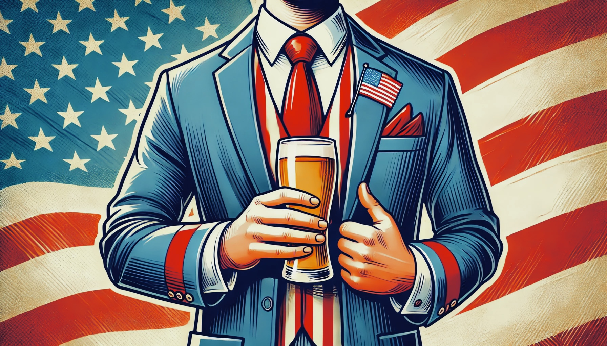

# Pints & Politics: Sipping Through Red, Blue, and Brew 🇺🇸🍺

In the light of recent elections and the ever-present passion for beer in American culture, we embark on a unique journey to uncover the fascinating link between politics and pints. This data story delves into the heart of the American lifestyle, exploring whether the beers we sip reveal more than just our taste preferences—perhaps even our political leanings 🤔.  

By analyzing beer styles, sentiments, and review ratings across the U.S., we aim to map out the subtle (and not-so-subtle) ways our brews align with political identities. We investigate how beer preferences vary by state, do they depend on the political leaning, whether swing states gravitate toward specific styles during election years and how the beer preference trends change throughout the years of 2004-2016.
This deep dive into Pints & Politics sets out to discover whether these two inherently American passions are linked or if, in the end, beer simply transcends party lines. Grab a pint and join us on this flavorful and thought-provoking journey!

The information about beer reviews we gather from a [BeerAdvocate](https://www.beeradvocate.com/) website. It contains over 2 million reviews coming from U.S. users. We find that this information is sufficient to conduct our analysis, leading to us focusing solely on the BeerAdvocate dataset. The reviews in the dataset are spanning over years from 2001 to 2017. 

Political information was gathered from several different sources. For our analysis we required information about the winning parties in each U.S. state, in the election years 2004-2016, obtained from [U.S. President 1976-2020](https://dataverse.harvard.edu/dataset.xhtml?persistentId=doi:10.7910/DVN/42MVDX). Age-specific voting preference was gathered from exit polls. The information was available for the mentioned election years ([Sources](#sources)), however not for all the states. This is due to the fact that exit polls are of interest in states that change their political climate over the years, *swing states*. Since conducting these surveys is costly, the consistently Democrat or Republican states are usually omitted.

## Research questions
Put research questions here.

## What's behind the beer reviews?

We examine the top 8 beer styles, such as IPA, Stout, and Lager, to identify the preferred types across U.S. states and explore potential connections to their political leanings. These 8 styles account for 75% of all reviews, which we consider sufficient for further analysis. Preference is defined as the average score given on the BeerAdvocate website, where ratings range from 1 to 5. Moreover, we analyze the sentiment of textual reviews for these beer styles, categorizing them as either positive or negative.

What are the most reviewed beers styles:

First of all, let's see what are the most preferred beer styles across U.S. states for each year:

The sentiment plot too...

comment on results,...

## Connection to politics

plot with winners over years
deeper analysis into potential confounding factors - age, where we get the data from. Why do we interpolate (motivation behind all this)

## Some plot for fun because that was lot of work



## Some other plot for fun because that was lot of work



## Sources

